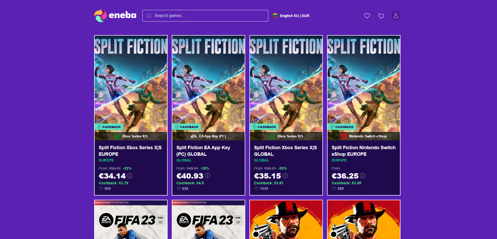
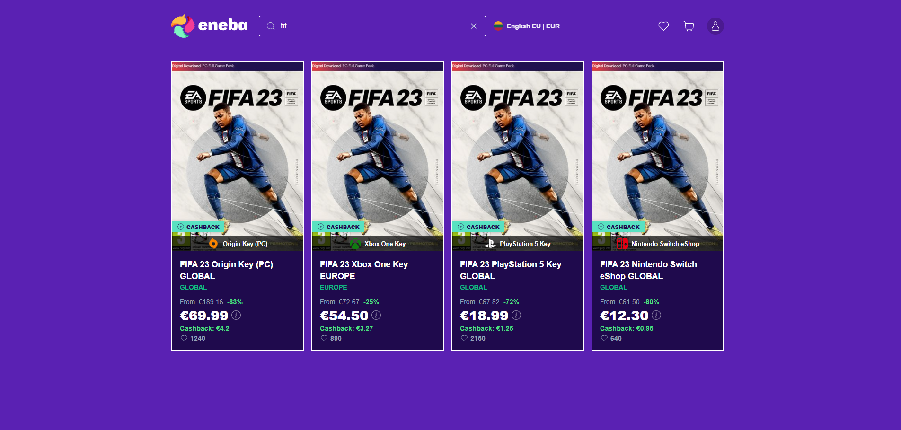
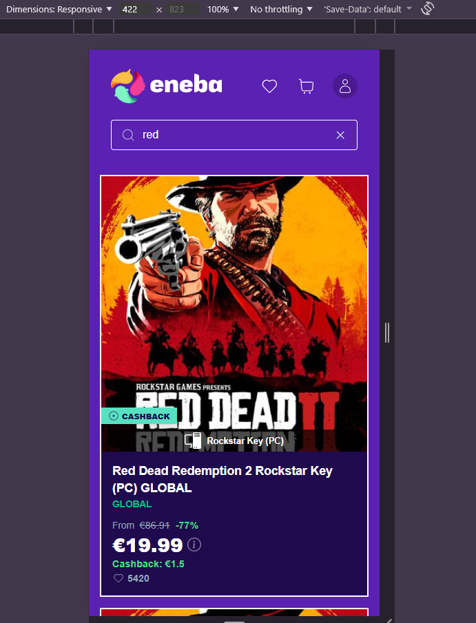

# Eneba Internship Assignment

Web application built for the Eneba internship assignment. It features a product listing page with search functionality

## Screenshots


_Desktop brower view_


_Fuzzy search functionality_


_Screen responsive design_

## Features

- **Dynamic Search**: Real-time, case-insensitive search for games directly from the header.
- **Responsive Design**: A fluid card grid that adapts to various screen sizes, from mobile to desktop.
- **Modern UI**: Clean and modern interface built with Styled-Components.
- **Price Display**: Calculates and displays original prices for discounted items.
- **Backend API**: A simple and effective Node.js/Express backend serving game data from a MongoDB database.

## Project Structure

- `/client`: A React frontend application built with Vite.
- `/server`: A Node.js backend API powered by Express.

## Technologies Used

- **Frontend**:
  - React
  - TypeScript
  - Vite
  - Styled-Components
  - React Icons
- **Backend**:
  - Node.js
  - Express.js
  - MongoDB
  - `dotenv` for environment variable management

## Getting Started

To run this project locally, you will need to set up and run both the backend server and the frontend client.

### 1. Backend Setup

The backend connects to a MongoDB database to fetch the game list.

**Steps**:

1.  **Navigate to the server directory:**

    ```bash
    cd server
    ```

2.  **Install dependencies:**

    ```bash
    npm install
    ```

3.  **Set up environment variables:**
    Create a `.env` file in the `server` directory.

    ```env
    # MongoDB Connection Details
    DB_USER=<your-database-user>
    DB_PASSWORD=<your-database-password>
    DB_CLUSTER=<your-cluster-name>
    DB_CLUSTER_ID=<your-cluster-id>

    # Server Port
    SERVER_PORT=5501
    ```

4.  **Start the server:**
    ```bash
    npm run dev
    ```
    The server will start on the port specified in your `.env` file (or `5501` by default) and connect to the database.

### 2. Frontend Setup

The frontend is a React application that communicates with the backend API.

**Steps**:

1.  **Navigate to the client directory (from the root):**

    ```bash
    cd client
    ```

2.  **Install dependencies:**

    ```bash
    npm install
    ```

3.  **Start the development server:**
    ```bash
    npm run dev
    ```
    The client application will start, typically on `http://localhost:5173`

## API Endpoints

The backend exposes the following endpoints:

- `GET /list`

  - Fetches all games from the database.

- `GET /list?search=<query>`
  - Performs a case-insensitive search for games where the title matches the `<query>`.
  - Example: `/list?search=fifa`

## Data Content

```env
{
  "_id": "1",
  "title": "Split Fiction",
  "platform": "EA App Key (PC)",
  "region": "GLOBAL",
  "price": 40.93,
  "currency": "EUR",
  "discount_percent": 18,
  "cashback": 4.5,
  "likes": 626,
  "image_url": "/Split-Fiction.jpg"
}
```
